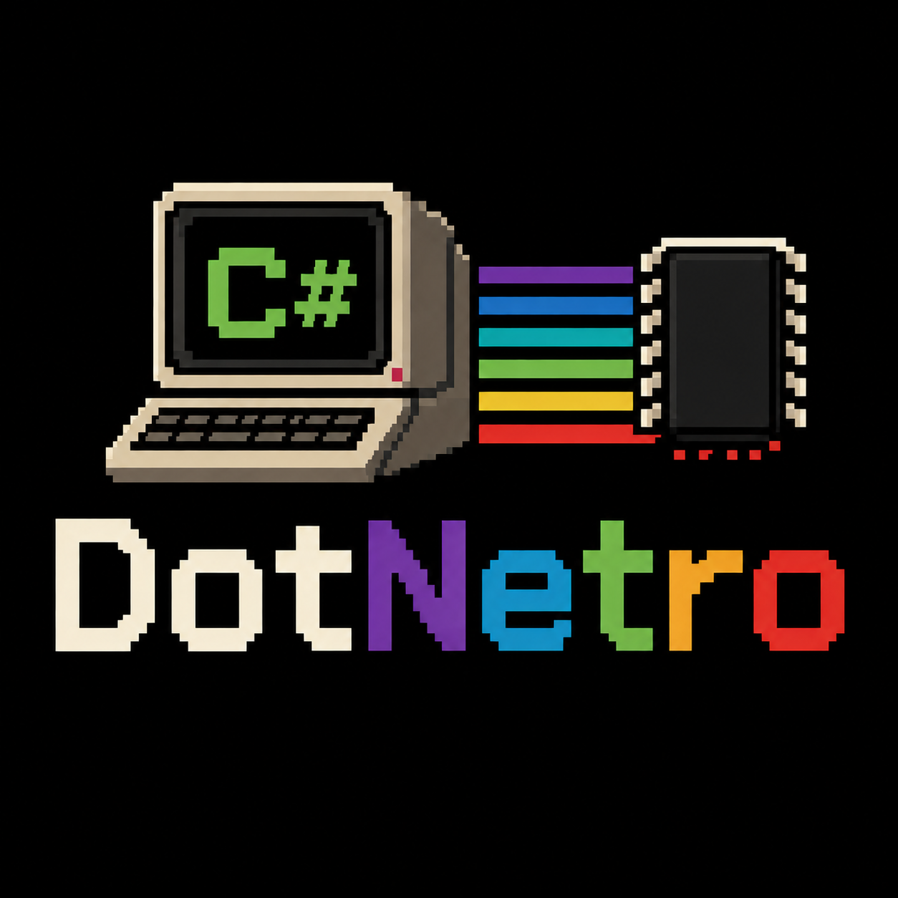

# DotNetro [](https://github.com/tgjones/DotNetro/actions/workflows/ci.yml)



DotNetro is a C# compiler for 8-bit computers.

DotNetro is an ahead-of-time compiler that turns a .NET assembly (IL bytecode)
into native machine code for vintage 8-bit machines. It reads ECMA-335
metadata, walks the IL, and lowers it into
assembly, then packages the result as a ready-to-run disk image.

## Targets

### CPUs

* MOS 6502

### Systems

* Acorn BBC Micro (`.ssd` disk image)

## IL support

This project is still in its early days. Only a small subset of IL is supported, and the
surface area grows as tests are written that demand it. Expect gaps: many
opcodes, types, and BCL methods are not implemented yet, and hitting an
unsupported construct will (hopefully) fail the compile rather than silently misbehave.
Treat the working samples and tests as the current source of truth for what
actually compiles.

## Getting started

Eventually DotNetro will be distributed as a convenient set of NuGet packages, but for now, it's necessary to build from this repo.

You need the .NET 10 SDK.

Build and test everything:

```bash
dotnet test --solution src
```

The `HelloWorld` sample compiles itself to a BBC Micro disk image as part of
its build:

```bash
dotnet build src/DotNetro.Samples.HelloWorld
# produces src/DotNetro.Samples.HelloWorld/bin/Debug/net10.0/DotNetro.Samples.HelloWorld.ssd
```

To compile any .NET assembly by hand, invoke the `dnrc` driver with the built
`.dll`:

```bash
dotnet run --project src/DotNetro.Compiler.Driver -- \
  --assembly path/to/Program.dll \
  --output program.ssd
```

Load the resulting `.ssd` in a BBC Micro emulator (or on real hardware) and
run it.

## Irie

Irie is DotNetro's code generator. It is a single unified "mixed-level" IR (MIR... heavily inspired by [MLIR](https://mlir.llvm.org)) that
flows through a chain of passes, starting as generic SSA operations on typed
virtual registers and ending as 6502 instructions on physical registers. Much of the codegen pipeline design follows the excellent [llvm-mos](https://github.com/llvm-mos/llvm-mos).

The example below adds two 16-bit integers. Because the 6502 is an 8-bit CPU
with no 16-bit add, the interesting work is splitting the wide add into a chain
of byte-wide adds threaded through the carry flag.

Start with C#:

```csharp
static short Add(short a, short b) => (short)(a + b);
```

The frontend lowers it to MIR, one generic add on 16-bit virtual registers:

```
func @Add : (i16, i16) -> i16 {
bb0(%0 : i16, %1 : i16):
    %2 : i16 = arith.addi %0, %1
    core.return %2
}
```

The legalizer narrows the 16-bit add into two 8-bit adds with carry, one per
byte, after ABI lowering has split each argument into its low and high bytes:

```
func @Add : (i16, i16) -> i16 {
bb0():
    [liveins: $a, $x, $zp2, $zp3]
    %3 : i8 = pseudo.copy $a
    %4 : i8 = pseudo.copy $x
    %5 : i8 = pseudo.copy $zp2
    %6 : i8 = pseudo.copy $zp3
    %13 : i1 = arith.constant 0
    %14 : i8, %15 : i1 = arith.addi_with_carry %3, %5, %13
    %16 : i8, %17 : i1 = arith.addi_with_carry %4, %6, %15
    $a = pseudo.copy %14
    $x = pseudo.copy %16
    pseudo.return
}
```

Instruction selection maps the generic ops onto 6502 opcodes, clearing the
carry first and chaining `adc`:

```
func @Add : (i16, i16) -> i16 {
bb0():
    [liveins: $a, $x, $zp2, $zp3]
    %3 : any8 = pseudo.copy $a
    %4 : any8 = pseudo.copy $x
    %5 : i8 = pseudo.copy $zp2
    %6 : i8 = pseudo.copy $zp3
    %18 : cc = mos6502.clc
    %19 : ac, %20 : cc = mos6502.adc %3(tied-def 0), %5, %18
    %21 : any8 = pseudo.copy %19
    %22 : ac, %23 : cc = mos6502.adc %4(tied-def 0), %6, %20
    %24 : any8 = pseudo.copy %22
    $a = pseudo.copy %21
    $x = pseudo.copy %24
    mos6502.rts implicit $a, implicit $x
}
```

Register allocation, copy elimination, and pseudo expansion assign physical
registers and resolve the copies into real 6502 moves:

```
func @Add : (i16, i16) -> i16 {
bb0():
    [liveins: $a, $x, $zp2, $zp3]
    $c = mos6502.clc
    $a, $c = mos6502.adc.zp $a, $zp2, $c
    $y = mos6502.tay $a
    $a = mos6502.txa $x
    $a, $c = mos6502.adc.zp $a, $zp3, $c
    $x = mos6502.tax $a
    $a = mos6502.tya $y
    mos6502.rts implicit $a, implicit $x
}
```

Finally the machine code layer emits 6502 assembly:

```asm
Add:
    CLC
    ADC $02
    TAY
    TXA
    ADC $03
    TAX
    TYA
    RTS
```

## Credits

DotNetro's 6502 code generation is modelled closely on
[llvm-mos](https://github.com/llvm-mos/llvm-mos), an excellent LLVM backend for
the 6502.

## License

MIT. See [LICENSE](LICENSE).
